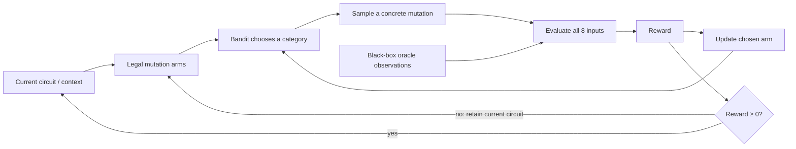

# Logic Garden

**Watch a multi-armed bandit grow a Boolean circuit.**

A small research playground where a bandit learns which kinds of circuit mutations are worth trying. Watch signals move, inspect each decision, and compare three strategies on reproducible Boolean experiments.

```text
 A ──┐                       MUTATION ARMS
     XOR ──┐                 ├─ change gate
 B ──┘     AND ── Y          ├─ add / remove gate
 C ────────┘                 ├─ rewire edge
                             └─ add / remove NOT
         observe → mutate → evaluate → learn
```

<!-- Preview slot: capture the live app and place docs/demo.gif or docs/screenshot.png here.
     Then replace this comment with .
     See docs/MEDIA.md for a short recording recipe. No fabricated screenshot is included. -->

## Run locally

Node.js **22.13 or later** is required; Node 22 is recommended. No API keys, database, or account are needed.

```bash
npm install
npm run dev
```

Open the Local URL printed in the terminal (usually `http://localhost:3000`). Select **START** to run, **PAUSE** to inspect, **STEP** for one decision, and **RESET** to reproduce the same experiment.

```bash
npm run build       # production bundle
npm start           # serve that bundle locally with Wrangler
npm test            # circuit, parser, bandit, simulation and research tests
npm run typecheck
npm run lint
npm run test:worker # verify the built Worker; run build first
npm run benchmark   # deterministic headless comparison, JSON on stdout
```

The application uses React 19, TypeScript, SVG and Tailwind CSS, with the Next.js App Router structure running on **Vinext / Vite**. Accessible controls use the bundled shadcn / Base UI primitives. This repository is ready to push to GitHub; it does not require deployment to use.

## Concept

There is an unknown Boolean function $f:\{0,1\}^3 \to \{0,1\}$. The learner only receives input/output observations. Its circuit $g_\theta$ predicts the same inputs, and its task is to improve those predictions by changing the circuit.

**An arm is a mutation category, not a gate and not an entire circuit.** The bandit learns which category to emphasize. After selection, a concrete legal mutation is sampled uniformly within that category. Candidate generation never consults the target's expression or candidate accuracy.

## How it works



1. Store the circuit as a topologically ordered DAG. Derive edges from node inputs.
2. Generate only valid candidates: no cycles, missing wires or invalid gate arities.
3. Mask categories with no legal candidates. They are not assigned artificial zero rewards.
4. Warm up each available category once, then select according to the bandit.
5. Evaluate the proposal on `000, 001, 010, 011, 100, 101, 110, 111`.
6. Update bandit statistics **even if the proposal is rejected**.
7. Accept nonnegative rewards, including neutral moves across an accuracy plateau.

Constraints: **3 inputs, at most 6 reachable gates, depth at most 3, 1 output**. The available gates are AND, OR, XOR, NAND, NOR and NOT. Disconnected gates are pruned. A direct input-to-output wire is a valid zero-gate circuit. Gate depth excludes input and output terminals.

The `Observation[]` evaluation boundary also permits a future sampled-input evaluator without giving the learner access to the target formula.

## Algorithms

| Strategy          | Decision rule                                                                                 | What the inspector shows                      |
| ----------------- | --------------------------------------------------------------------------------------------- | --------------------------------------------- |
| ε-Greedy          | With probability ε choose a random available arm; otherwise choose the highest empirical mean | Mean, ε, exploratory/exploitative decision    |
| UCB1              | Maximize $\bar r_i + \sqrt{2\ln(t)/N_i}$                                                      | Normalized mean, exploration bonus, UCB score |
| Thompson Sampling | Draw $\theta_i \sim \mathrm{Beta}(\alpha_i,\beta_i)$, then maximize θ                         | α, β and the sampled θ                        |

UCB1 uses `t = total pulls before this decision`. Untried arms receive warm-up selection before the finite score formula is used. Ties are broken with the seeded random stream.

Thompson Sampling begins with Beta(1, 1). After observing a normalized reward $\tilde r$, draw $z\sim\mathrm{Bernoulli}(\tilde r)$, then update $\alpha\leftarrow\alpha+z$, $\beta\leftarrow\beta+1-z$. This keeps a valid Beta-Bernoulli posterior on **randomized normalized outcomes**; it adds sampling noise and is not a posterior over deterministic accuracy gains. Fractional pseudo-counts are not used.

## Reward

Raw mutation reward is

$$r_t = \mathrm{accuracy}(g') - \mathrm{accuracy}(g) - \lambda\bigl(|g'|-|g|\bigr).$$

The complexity switch sets $\lambda=0.01$; otherwise $\lambda=0$. Size means the number of reachable logic gates, including NOT.

All policies compare a consistent bounded reward:

$$B = 1 + 6\lambda,\qquad \tilde r_t = \frac{r_t+B}{2B} \in [0,1].$$

The affine map preserves reward ordering. A neutral mutation maps to 0.5; negative rewards are not clipped to zero. The arm table and cumulative reward display **raw rewards**, while UCB scores and posterior updates use normalized rewards. Cumulative reward sums all proposals, so it can be negative even when the current circuit has improved.

Scores in the decision inspector describe the state **before the last pull**. Pull counts, raw mean rewards and posterior parameters include its update.

## Regret and exploration

This demo uses best-seen **pseudo regret**, evaluated after the acceptance decision:

$$\mathrm{regret}_t=\mathrm{best\_accuracy\_seen}_t-\mathrm{current\_accuracy}_t,\qquad R_T=\sum_{t=1}^T\mathrm{regret}_t.$$

Best seen includes evaluated proposals and retains the corresponding best circuit. With exhaustive 3-input evaluation, accuracy moves in increments of 1/8. With the supplied λ values, accepted moves cannot lower accuracy. Consequently **pseudo regret is normally zero, including at a suboptimal local optimum**. It is not regret against a known perfect oracle, and a zero value does not establish convergence.

The displayed exploratory-decision share counts warm-up and ε-random choices. For UCB/Thompson it counts choices whose empirical normalized mean is below the current maximum among available arms. This is a descriptive classification, not a calibrated probability; posterior sampling does not have a separate explicit exploration branch.

## Using the laboratory

- **Targets:** `A XOR B`, `A AND B`, `(A XOR B) AND C`, `(A AND B) OR C`, majority, a seeded random truth table, or a custom expression.
- **Custom parser:** A, B, C, constants 0/1, parentheses, NOT, AND/NAND, XOR, OR/NOR. Aliases `!`, `&`, `&&`, `^`, `|`, `||` are supported. Precedence is NOT → AND/NAND → XOR → OR/NOR. No `eval` or `Function` is used.
- **Settings:** target, strategy, seed, epsilon and complexity changes restart the experiment. Speed changes preserve it. Press the arrow next to the seed input to apply it.
- **Speed:** 1×, 5×, 20×, MAX. MAX processes small batches without changing the seeded trajectory. Backgrounding the page pauses live simulation.
- **Probe:** select a truth-table row to pause and trace its signals. Return to auto to follow iteration modulo 8. Every round still evaluates all eight inputs.
- **Visual history:** bright active paths, moving signals, mutation flashes, fading node activity, four compact traces and a terminal log. Reduced-motion preferences disable animation.
- **Memory:** the last 240 history samples and 80 mutation logs are retained. Aggregate counts and rewards cover the full experiment.

## Research mode

Run ε-Greedy, UCB1 and Thompson Sampling for **5, 10 or 20 paired trials**, each lasting **250, 500 or 1,000 rounds**, in a dedicated Web Worker. Stop is immediate and discards the in-flight trial. Completed trial results can be exported as JSON, including configuration and target observations.

For trial index $j$, all strategies use seed `(base + j) mod 2^32`, the same starting circuit, and the **same target truth table**. In particular, a random target is generated once from the base seed, not regenerated per trial. Arm selection, within-category mutations and Bernoulli updates have separate seeded streams. Policies diverge because their decisions consume different randomness; equal seeds do not imply equal proposed circuits after divergence.

Compare final accuracy (mean ± sample SD), solved fraction, median rounds to 100%, cumulative reward, pseudo regret and circuit size. Time to 100% is reported in **rounds**, not wall-clock time. Its median includes solved trials only; unsolved trials are censored at the budget and remain visible in the solved fraction.

A small benchmark is included in [docs/benchmark-seed-42.json](docs/benchmark-seed-42.json). Reproduce it with:

```bash
node --import tsx scripts/benchmark.ts > docs/benchmark-seed-42.json
```

It is an illustrative five-trial sample, not evidence of a universally superior strategy. Reward distributions and arm availability change as the circuit changes, so the stationary assumptions behind classical bandit regret bounds do not hold.

## Architecture

```text
app/                            App Router entry point, metadata, theme
src/
  random.ts                     Seeded RNG, normal/gamma/Beta samplers
  algorithms/bandit/
    epsilonGreedy.ts            ε-Greedy selection
    ucb1.ts                     Upper confidence bound selection
    thompsonSampling.ts         Posterior sampling
    types.ts / index.ts         Shared statistics, normalization, updates
  circuit/
    circuit.ts                  DAG representation, validation, pruning
    evaluator.ts                Signal evaluation and oracle observations
    booleanFunctions.ts         Presets, random oracle, safe expression parser
    mutations.ts                Target-independent mutation candidates
  simulation/
    simulator.ts                One-round orchestration and bounded history
    research.ts                 Paired trials and summary statistics
    research.worker.ts          Background experiment execution
  components/                   Circuit, controls, arms, metrics, log, research
components/ui/                  Vendored accessible UI primitives
scripts/                        Headless benchmark and built-Worker check
tests/                          Node test runner + TypeScript
```

The core has no React or timer dependency. `Simulator` owns its seeded state; the UI schedules rounds and renders snapshots. Candidates are cached while a circuit is unchanged. Research runs the same engine, not a separate approximation. The `bestCircuit` archive is available in snapshots.

Lint covers authored application and test code; untouched scaffold UI primitives and their generated mobile hook are excluded. The optional, feature-detected `step_logic_garden` WebMCP adapter shares the visible STEP action; the application also works without WebMCP.

## Limitations and review

- Greedy acceptance may reach a local optimum. Neutral moves help, but convergence to 100% is not guaranteed.
- Some random/custom Boolean functions may not fit the gate/depth budget.
- Gate types and wiring are selected structurally; this is mutation-category learning, not contextual or combinatorial bandit optimization.
- There is no persistence across browser reloads. Save research results via export or reproduce a run using its settings.
- Vinext is a beta runtime. Dependencies are pinned and `package-lock.json` is included with the source.

See [docs/REVIEW.md](docs/REVIEW.md) for validation and design tradeoffs. CI runs the same checks on pushes and pull requests.

## Future work

- Contextual Bandit
- Combinatorial Bandit
- Comparison with genetic algorithms
- Comparison with Bayesian optimization
- Larger Boolean circuits
- Noisy observations and sampled evaluation
- Restarts, annealing and local-optimum escape
- FPGA synthesis
- Real-world optimization

## License

MIT. Third-party packages retain their respective licenses.

## Contributing and publishing

See [CONTRIBUTING.md](CONTRIBUTING.md) for the development workflow and bug report
details. The repository's [publishing guide](docs/PUBLISHING.md) describes the
prepared GitHub publication step. Publishing the source does not deploy a website.
